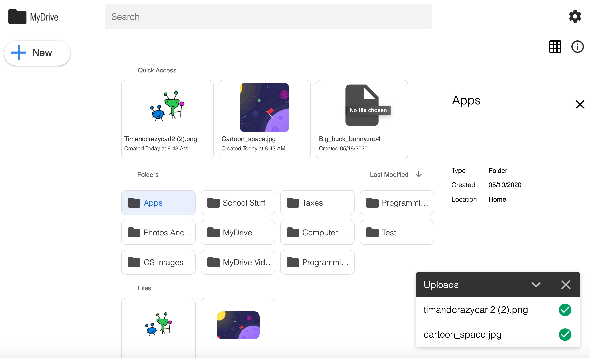

# 

# MyDrive

MyDrive is an Open Source Cloud Server (Similar To Google Drive), MyDrive supports multiple services to store files (Amazon S3, MongoDB, the FileSystem), and is built with Node.js and Typescript. MyDrive now even has Docker Images!

## Index

* [Features](#features)
* [Installation](#installation)
* [Wiki](https://github.com/subnub/myDrive/wiki)
* [Demo](#demo)
* [Screenshots](#screenshots)

## Features

* Upload Files
* Download Files
* Share Files
* Mutilple DB Support (MongoDB, S3, Filesystem)
* Photo Viewer
* Video Viewer
* Thumbnails
* One-time download links
* Move Folder/Files
* Mobile Support
* Docker Support
* Search/Filter Options
* AES256 Encryption

## Installation

>Install Node Modules
``` javascript
npm install
```

>Create Enviroment Variables, Users can use the built in command to easily create the needed Enviroment files, or view the Enviroment Variables section to see how to manually create the files. 
``` javascript
npm run setup
```

>Run the build command
``` javascript
npm run build
```

>Start the server
``` javascript
npm run start
```

## Demo

Demo: https://mydrive-demo.herokuapp.com/
- Note: The Upload and Download Features, and other core features, are disabled in the demo. 

## Screenshots

### Wiki

For a more detailed list of myDrive features, including examples with images, visit the wiki here: https://github.com/subnub/myDrive/wiki

MyDrive Features:

- Upload Files
- Download Files
- Create Folders
- Share Files
- Creates Image Thumbnails
- Photo-Viewer
- Stream Video
- Transcode Video
- Create One-Time Download links for files
- Move Files/Folders
- AES256 Encryption (For file chunks, tokens, and more!)
- Search For Files/Folders
- Mobile Friendly (Including Uploading!)
- Advanced Filter Options

## Installation

Required:
- Node.js (13.9+ Is Recommended)
- MongoDB

Windows users will usually need both the microsoft visual build tools, and python 2. These are required to build the sharp module.
- Visual Tools: http://go.microsoft.com/fwlink/?LinkId=691126
- Python 2: https://www.python.org/downloads/release/python-2717/

Optional:
- FFMPEG (For Video Transcoding, Does not work very well because of encryption ATM, But non-transcoded video streams work much better, I do not recommend using transcoding yet.)

Setup:
- “npm install”, Installs all dependencies. 

- "npm run init", Asks user for some environment variable details, pressing enter on these fields will instead use the default values. 

- "npm run build" or "npm run build:no-ssl", This will look for the HTTPS Certificate, Place this HTTPS certificate at the root of the project, with the naming convention (certificate.ca-bundle, certificate.crt, and certificate.key). 
Note: If you do not have or want to use a HTTPS certificate, run "npm run build:no-ssl". This will run the server in production mode, without SSL encryption, this is vulnerable to man in the middle attacks!

- “npm run create-indexes-database”, This will create indexes for mongoDB, this is greatly recommended, it will improve mongoDBs speed in retrieving files. 

- "npm start" or "npm run start:no-ssl". If you do not want SSL Encryption use "npm run start:no-ssl".

- It will then ask for an encryption key, this can be whatever you would like, this key is later hashed. Do not lose this key, there is NO way to recover data from a lost key!

- That's It! Now just Create a new account.

## Enviroment Variables

The npm run init command will create the needed env variables, but if you would like to create them manually, structure the files like so.

Backend variables: Stored in /config/prod.env

- MONGODB_URL=
- PASSWORD=
- HTTP_PORT=
- HTTPS_PORT=
- URL=
- FULL_URL=
- ROOT=

Optional:
- KEY=

The KEY variable is optional, without it the server will prompt you for a password on startup, with a KEY the server will skip prompting for the password, use a KEY if you want to use myDrive with docker, or similar tools.

Frontend variables: Stored on the root of the project .env.production 

- PORT=
- REMOTE_URL=

## Built In Server Tools

MyDrive comes with some built in NPM scripts for server management, this includes:
- Backup Database: Command “npm run backup-database", creates a temporary backup of the database inside of mongoDB, please note you can only have one backup at a time, for better backups use mongoExport. 

- Restore Database: Command “npm run restore-database”, Restores Database from backup. 

- Clean Database: Command “npm run clean-database”, Cleans database, removing any orphaned chunks that do not have a file associated with them, this command will automatically run backup database, incase anything fails. 

- Change Encryption Password: Command “change-password-database”, Changed the encryption password, that the server first asks for on start up, this requires the old encryption password. This will also create a new backup, incase anything fails.

- Delete Database: Command “npm run delete-database”, Deletes the main database, does not delete the temporary backup.

- Delete Temp Database: Command “npm run delete-temp-database”, Deletes the database backup. 

- Create Indexes: Command “npm run create-indexes-database", Creates Indexes for mongoDB, without this mongoDB will need to search through every single file on request, run this before using the server. 

- Run Tests: Command "npm run test", Starts unit testing.

## Video
I created a short YouTube video, showing off myDrives design and features: https://youtu.be/0YKU5CZHG4I

## Security 
MyDrive encrypts all file chunks, tokens, and temp tokens. These items are first encrypted with a randomly generated 32 byte private key, and random 16 byte public key (A different random public key is used for different items).The private key is encrypted with the users salted password, and then the hashed server key (Acquired on server startup). Note: Running the command to change the servers key, will generate new private and public keys for each user, and will have to re-encrypt all chunks. 

### Using myDrive for personal use?
After you create your account, disable the ability to create a new account by adding the following value to the prod.env file (Located inside on the config folder).
BLOCK_CREATE_ACCOUNT=true

## Questions? Feature Requests? Hiring? Contact Me!
Contact Email: kyle.hoell@gmail.com

## Follow my twitter account 
Twitter: https://twitter.com/subnub2


